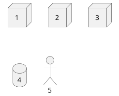

# Основные требования 
Фактически, т.к это все является проектом для портфолио, и врятли это перерастет в проект, который будет коммерчески поддерживаться требования к архитектуре не будут учитывать физические характеристики серверов\
## Бизнес требования 
|№| Описание | 
|---|---|
| 1 | Должно сохраняться любое изменение цены на любом продукте из выборки|
| 2 | Должен существовать реестр продуктов, который может быть обновлен| 
| 3 | Должен существовать реестр фирм являющихся продавцами| 
| 4 | Должен существовать реестр производителей продуктов|
| 5 | Должна существовать возможность произвводить анализ изменений продуктов (содержание продукта)| 
| 6 | Должна существовать возможность производить анализ изменений цен на продукты |

## Функциональные требования 

| № | Описание | 
|---|---| 
| 1 | Система должна имееть возможность отслеживать изменение цен на продуктах, сохранять эти данные |
| 2 | Система должна иметь возможность сохранять данные о производителях товаров первой необходимости | 
| 3 | Авторизация и аутентификация | 
| 4 | Система должна иметь функционал генерации отчётов |
| 5 | Система должна иметь возможность выгрузить отчёты из системы|
| 6 | Система должна иметь возможность сохранять отчёты за предыдущее время | 
| 7 | Система должна иметь Ролевую модель|
| 8 | Система должна иметь возможность строить отчёт об изменении цен и продавцах, которые участвуют  | 
| 9 | Система должна проверять на изменение цен продукты из реестра продуктов и проверять это изменение в реестре производителя| 

Будут расширятся по мере развития моей фантазии, пока остановимся на этом

## Не функциональные требования 

## Предполагаемая архитектура 
