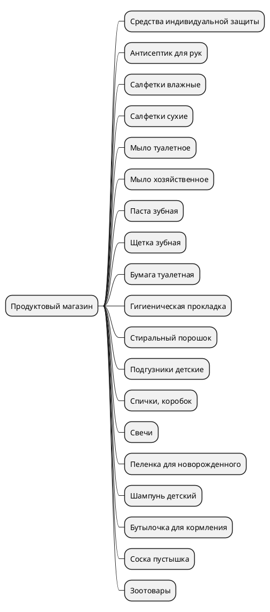

# Основная логика
Данный проект нацелен на парсинг и хранение, а также аналитику изменения динамики цен на продуктах первой необходимости
## Что подразумевается под "Продуктом первой необходимости"?
Продукт первой необходимости — это товары, которые необходимы для поддержания здоровья и жизни людей и пользуются повышенным спросом, а также являются поддерживающим фактором общественного благосостояния.
## Что входит в перечень продуктов первой необходимости?
Продовольственные товары
|№|Наименование|
|---|---|
| 1 | говядина  |
| 2 | свинина |
| 3 | баранина |
| 4 | куры  |
| 5 | рыба мороженая неразделанная |
| 6 | масло сливочное |
| 7 | масло подсолнечное |
| 8 | молоко питьевое | 
| 9 | яйца куриные |
| 10 | сахар-песок |
| 11 | соль поваренная пищевая |
| 12 | чай черный байховый |
| 13 | мука пшеничная |
| 14 | хлеб ржаной, ржано-пшеничный |
| 15 | хлеб и булочные изделия из пшеничной муки | 
| 16 | рис шлифованный | 
| 17 | пшено |
| 18 | крупа гречневая ‒ ядрица |
| 19 | вермишель |
| 20 | картофель |
| 21 | капуста белокочанная свежая |
| 22 | лук репчатый | 
| 23 | морковь |
| 24 | яблоки | 

Непродовольственные товары 

|№|Наименование|
|---|---|
| 1 | средства индивидуальной защиты |
| 2 | антисептик для рук |
| 3 | салфетки влажные |
| 4 | салфетки сухие |
| 5 | мыло туалетное |
| 6 | мыло хозяйственное |
| 7 | паста зубная |
| 8 | щетка зубная |
| 9 | бумага туалетная |
| 10 | гигиенические прокладки |
| 11 |стиральный порошок |
| 12 |подгузники детские |
| 13 |спички, коробок |
| 14 | свечи |
| 15 |пеленка для новорожденного |
| 16 | шампунь детский |
| 17 |крем от опрелостей детский |
| 18 |бутылочка для кормления |
| 19 |соска-пустышка |
| 20 |бензин автомобильный |
| 21 |дизельное топливо |
| 22 |газомоторное топливо (компримированный природный газ, сжиженный природный газ, сжиженный углеводородный газ) |
| 23 | зоотовары (включая корма для животных и ветеринарные препараты) |

Теперь мы имеем группы товаров, которые нам необходимо рассматривать в качестве основных товаров, которые мы должны будем рассматривать, в приоритетную очередь, теперь необходимо определить, какие продавцы будут отражаться в нашей статистике 

Их необходимо разделить на следующие группы 
### Продуктовые магазины
В продуктовых магазинах содержится следующее 

Исходный код

### Аптеки 
### Заправки 
### Бытовые магазины 
### Маркет-плейс 

