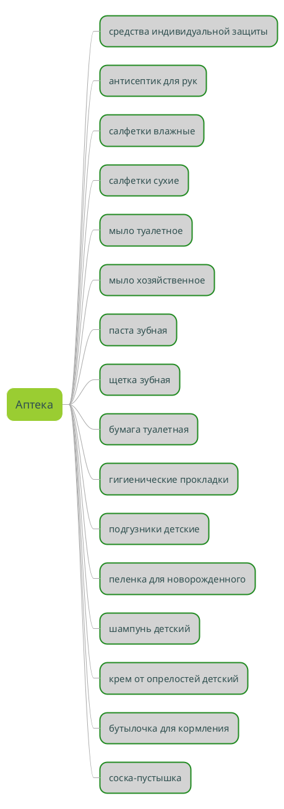
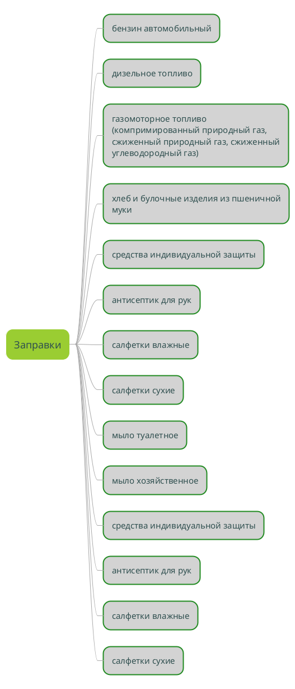

# Основная логика
Данный проект нацелен на парсинг и хранение, а также аналитику изменения динамики цен на продуктах первой необходимости
## Что подразумевается под "Продуктом первой необходимости"?
Продукт первой необходимости — это товары, которые необходимы для поддержания здоровья и жизни людей и пользуются повышенным спросом, а также являются поддерживающим фактором общественного благосостояния.
## Что входит в перечень продуктов первой необходимости?
Продовольственные товары
|№|Наименование|
|---|---|
| 1 | говядина  |
| 2 | свинина |
| 3 | баранина |
| 4 | куры  |
| 5 | рыба мороженая неразделанная |
| 6 | масло сливочное |
| 7 | масло подсолнечное |
| 8 | молоко питьевое | 
| 9 | яйца куриные |
| 10 | сахар-песок |
| 11 | соль поваренная пищевая |
| 12 | чай черный байховый |
| 13 | мука пшеничная |
| 14 | хлеб ржаной, ржано-пшеничный |
| 15 | хлеб и булочные изделия из пшеничной муки | 
| 16 | рис шлифованный | 
| 17 | пшено |
| 18 | крупа гречневая ‒ ядрица |
| 19 | вермишель |
| 20 | картофель |
| 21 | капуста белокочанная свежая |
| 22 | лук репчатый | 
| 23 | морковь |
| 24 | яблоки | 

Непродовольственные товары 

|№|Наименование|
|---|---|
| 1 | средства индивидуальной защиты |
| 2 | антисептик для рук |
| 3 | салфетки влажные |
| 4 | салфетки сухие |
| 5 | мыло туалетное |
| 6 | мыло хозяйственное |
| 7 | паста зубная |
| 8 | щетка зубная |
| 9 | бумага туалетная |
| 10 | гигиенические прокладки |
| 11 |стиральный порошок |
| 12 |подгузники детские |
| 13 |спички, коробок |
| 14 | свечи |
| 15 |пеленка для новорожденного |
| 16 | шампунь детский |
| 17 |крем от опрелостей детский |
| 18 |бутылочка для кормления |
| 19 |соска-пустышка |
| 20 |бензин автомобильный |
| 21 |дизельное топливо |
| 22 |газомоторное топливо (компримированный природный газ, сжиженный природный газ, сжиженный углеводородный газ) |
| 23 | зоотовары (включая корма для животных и ветеринарные препараты) |

Теперь мы имеем группы товаров, которые нам необходимо рассматривать в качестве основных товаров, которые мы должны будем рассматривать, в приоритетную очередь, теперь необходимо определить, какие продавцы будут отражаться в нашей статистике 

Их необходимо разделить на следующие группы 
### Продуктовые магазины
| № | Наименование | 
|---|---|
| | |

В продуктовых магазинах содержится следующее 

Исходный код

```plantuml
@startmindmap
skinparam ArrowColor DarkGrey
<style>
mindmapDiagram {
  node {
    Padding 15
    Margin 15
    BackGroundColor YellowGreen
    FontColor DarkSlateGrey
    LineColor White
    LineThickness 1.0
    MaximumWidth 320
  }
  rootNode {
    Padding 15
    Margin 15
    BackGroundColor YellowGreen
    FontColor DarkSlateGrey
    FontSize 18
    LineColor White
    LineThickness 1.0
  }
  leafNode {
    Padding 15
    Margin 15
    BackGroundColor LightGray
    FontColor DarkSlateGrey
    FontSize 15
    LineColor ForestGreen
    LineThickness 2.0
  }
  ' Styles to apply to tasks based on status:
  ' in progress (i)
  .i {
    BackgroundColor SkyBlue
  }
  ' completed (c)
  .c {
    BackgroundColor LightSlateGray
    FontStyle italic
    FontColor DarkGray
  }
  ' urgent (u)
  .u {
    BackgroundColor OrangeRed
    FontStyle bold
  }
  ' delegated (d)
  .d {
    BackgroundColor Gold
  }
}
</style>
* Продуктовый магазин
** Средства индивидуальной защиты
** Антисептик для рук
** Салфетки влажные
** Салфетки сухие
** Мыло туалетное
** Мыло хозяйственное
** Паста зубная
** Щетка зубная
** Бумага туалетная
** Гигиеническая прокладка
** Стиральный порошок
** Подгузники детские
** Спички, коробок
** Свечи
** Пеленка для новорожденного
** Шампунь детский
** Бутылочка для кормления
** Соска пустышка
** Зоотовары
** говядина
** свинина
** баранина
** куры
** рыба мороженая неразделанная
** масло сливочное
** масло подсолнечное
** молоко питьевое
** яйца куриные
** сахар-песок
** соль поваренная пищевая
** чай черный байховый
** мука пшеничная
** хлеб ржаной, ржано-пшеничный
** хлеб и булочные изделия из пшеничной муки
** рис шлифованный
** пшено
** крупа гречневая ‒ ядрица
** вермишель
** картофель
** капуста белокочанная свежая
** лук репчатый
** морковь
** яблоки
@endmindmap
@endmindmap

```

|1| Ашан |
### Аптеки
Необходимо выделить следующие аптеки, как те, на ценообразование которых необходимо опираться 
| № | Наименование | 
|---|---|
|1|Бережная аптека|
|2|Будь здоров!|
|3|Вита-Фарм|
|4|Планета здоровья|
|5|Аптека ДА|
|6|36.7|
|7|Фармида|
|8|Надежда ФАРМ|
|9|Сеть аптек ЛЕто|
|10|Аптека эконом|
|11|7 дней|
|12|Магнит Аптека|
|13|Вита Кэшбэк до 50%|
|14|Авиценна|
|15|Аптека низкиз цен|
|16|Аптека Вита центральная|
|17|Здравсити|
|18|Жукова Партнер|
|19|Радуга|
|20|Туринская центральная|
|21|Дисконт-аптека|
|22|Аптека Алоэ|
|23|Аптека эвалар|
|24|Лаки фарма|
|25|Авилек|
|26|Мозаика|
|27|Забота 24|
|28|Первомайская|
|29|Аптека низкие цены|
|30|Мини цена сеть аптек|
|31|Ригла|
|32|Социальная аптека|
|33|Аптечный мир|
|34|Мир здоровья|
|35|Пилюлька|
|36|Апельсин|
|37|Фито фарм|
|38|Народная аптека|
|39|Сеть аптек дешёвая аптека|
|40|Альфа сеть аптек|
|41|Экона аптека|
|42|Столичка|
|43|НеоФарм|
|44|Фарм24|
|45|Мята|
|46|Сити фарм|
|47|Здоров.ру|
|48|Аптека Больше чем меньше |
|49|Здоровье|
|50|Вита экспресс|
|51|Аптека маркет|
|52|36.6|

### Заправки 
Тут будет указан список заправок 

### Маркет-плейс 
Маркет-плейс может содежрать все вышеперечисленное, помимо бензина и дизельного и газомоторного топлива.в 
|№|Наименование|
|---|---|
|1| Wildberries|
|2| Ozon|
|3| YandexMarket|
